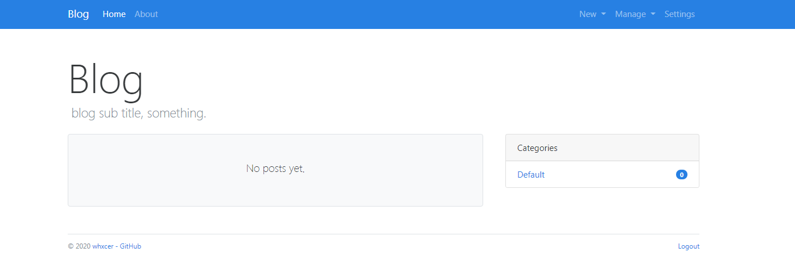
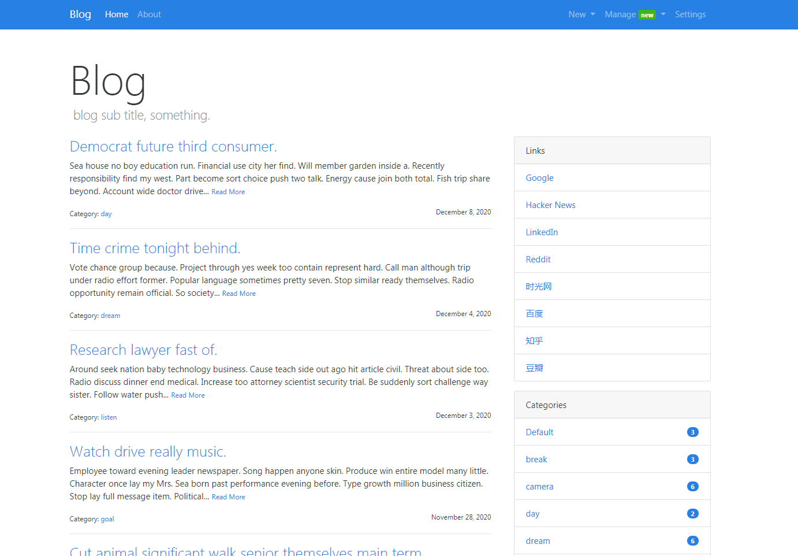
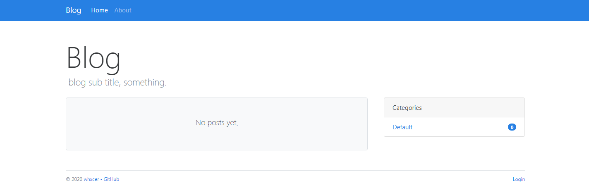
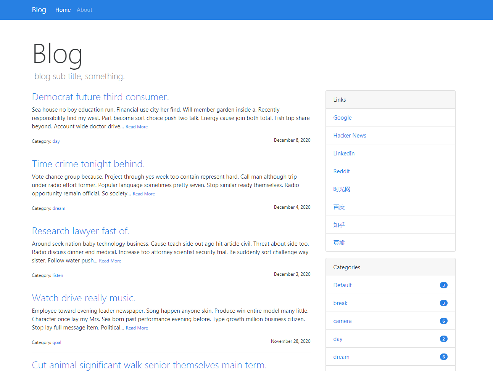

# Blog

使用 Flask 完成的个人博客功能


## 项目截图

管理员画面:
- 无数据:



- 有数据:




游客画面:
- 无数据:



- 有数据:




## 项目功能
- 创建文章/分类/评论
- 编辑文章/分类
- 删除文章/分类/评论
- 回复评论
- 管理后台


## 项目运行
```bash
# 克隆项目
$ git clone https://github.com/wtraceback/Blog.git
# 切换至目录
$ cd Blog
# 安装虚拟环境
$ python -m venv venv
# 启动虚拟环境
$ venv\Scripts\activate
# 安装依赖
$ pip install -r requirements.txt
# 生成虚拟数据
$ flask forge
# 运行项目
$ flask run
* Running on http://127.0.0.1:5000/
```


### 测试账户
- 用户名: `admin`
- 密码: `123456`


### 命令行
自定义命令:
- 删除旧数据库并创建新的空数据库: `flask initdb`
- 更改或生成管理员数据: `flask initadmin`
- 批量生成虚拟数据: `flask forge`
